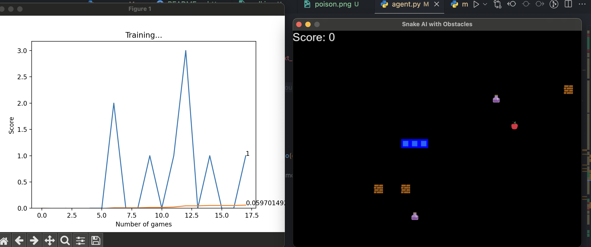
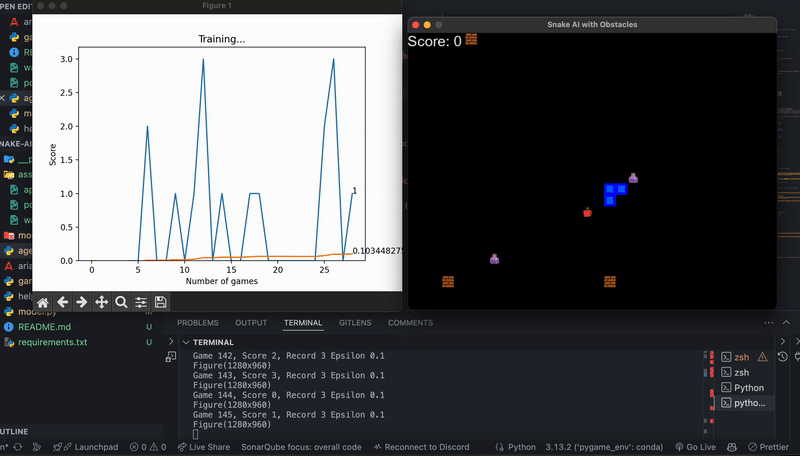

### **📥 Download the Updated README File**  
🔗 **[Download README.md](sandbox:/mnt/data/README.md)**  

---

### **Or Copy-Paste the Code Below**
```md
# **🐍 Snake AI with Reinforcement Learning (PyTorch)**
🚀 **An AI-powered Snake game built using PyTorch and Deep Reinforcement Learning (DQN).**  
Inspired by the **freeCodeCamp** tutorial on **Deep Q-Learning**, originally from [Patrick Loeber's GitHub](https://github.com/patrickloeber).  
I have significantly **enhanced** and **optimized** the project, adding new features to make the AI smarter, faster, and more robust.

  


---

## **📌 Project Overview**
This project is a **self-learning AI agent** that plays the **Snake game** using **Deep Reinforcement Learning**.  
It uses **PyTorch** to train a model that predicts the best moves, improving over time.  

🔹 **Original Tutorial**: FreeCodeCamp YouTube Channel  
🔹 **Original Code**: [Patrick Loeber's GitHub](https://github.com/patrickloeber)  

However, I **extended and improved** the original project in many ways.  
That said, **it's still a work in progress**, as I'm experimenting with **different state representations**. Currently, the AI is learning with **many input states**, which may slow down training. Optimizing the number of states could further improve its performance.

---

## **🆕 Enhancements & Improvements**
🔥 **New Features & Fixes I Added:**
✅ **Improved Reward System **  
- Added **walls** 🧱 that the snake must avoid  
- Introduced **poison** ☠️ to penalize the AI when eaten  
- Optimized the reward system to encourage better learning  

✅ **Performance Optimizations**  
- Optimized for **Mac (MPS acceleration)** to prevent overheating  
- **Better memory management** using prioritized replay  
- **Fixed reward shaping** to help the AI learn faster  

✅ **Input State Optimization (For Faster Learning)**  
- The AI currently uses **28 states as input**  
- If you want to improve **training speed**, consider **removing less important states**  
  - **For example, you can remove:**  
    - **Poison detection** (if not needed)  
    - **Wall collision detection** (if it’s too complex for your case)  
- Reducing the number of states **makes training faster but may slightly reduce AI accuracy**  

✅ **Advanced Collision Detection**  
- AI can now differentiate **walls, poison, and borders**  
- Improved **self-collision detection** for better training  

✅ **Better UI & Visualization**  
- **Replaced colored blocks** with actual **icons** 🎨  
  - 🍏 **Apple (food)**  
  - ☠️ **Poison**  
  - 🧱 **Walls**  
- Display **score & training stats** dynamically  

✅ **Ability to Save & Load Training**  
- AI **remembers past training** instead of starting from scratch  
- Saves **model weights & training state** (`model.pth`)  

✅ **[Future Plan] Multiplayer AI**  
- Adding **two AI agents competing** against each other 🎯🔥  

---

## **📖 How It Works**
### **🏗️ Technologies Used**
- **Python** 🐍  
- **PyTorch** (Deep Q-Learning)  
- **OpenAI Gym Concepts**  
- **Pygame** (Game Engine)  

### **🧠 AI Learning Process**
1️⃣ The **AI plays the game** and tries random moves  
2️⃣ It **learns from rewards & penalties**  
3️⃣ Over time, the model **improves** using Deep Q-Learning  
4️⃣ The **AI trains itself to become a pro!** 🎯  

---

## **🚀 Setup & Installation**
### **📥 1. Clone the Repository**
```bash
git clone https://github.com/P-Bunnet/snake-ai-pytorch.git
cd snake-ai-pytorch
```

### **📦 2. Install Dependencies**
```bash
pip install -r requirements.txt
```

### **🖥️ 3. Run the AI**
```bash
python agent.py
```

---

## **📊 Results & AI Performance**
### **🧠 How the AI Improves Over Time**
At the beginning, the AI plays **randomly** and often loses quickly.  
However, as it plays more games, it learns to **avoid obstacles, chase food efficiently, and maximize its survival time**.  
The **longer it trains, the smarter it becomes**!  

📸 **[Screenshots]**  
  

🎥 **[Watch AI Gameplay]**  
  


---

## **🎯 Future Plans**
🔜 **Add multiplayer AI (2 agents playing together)**  
🔜 **Fine-tune the AI for even better decision-making**  
🔜 **Train AI with more complex environments**  

---

## **🧑‍💻 About Me**  
Hi! I'm **P-Bunnet**, a **Software Engineer** with **4 years of full-stack development experience**.  

I have some experience working with **AI**, and I'm particularly interested in **reinforcement learning**. This project is part of my journey to **deepen my understanding of machine learning**, experiment with **training intelligent agents**, and explore **practical applications of deep learning**.  


---

## **📩 Connect with Me**
📌 **GitHub**: [github.com/P-Bunnet](https://github.com/P-Bunnet)  
📌 **LinkedIn**: [LinkedIn Profile](https://www.linkedin.com/in/bunnet-phoung-734a31210/)


